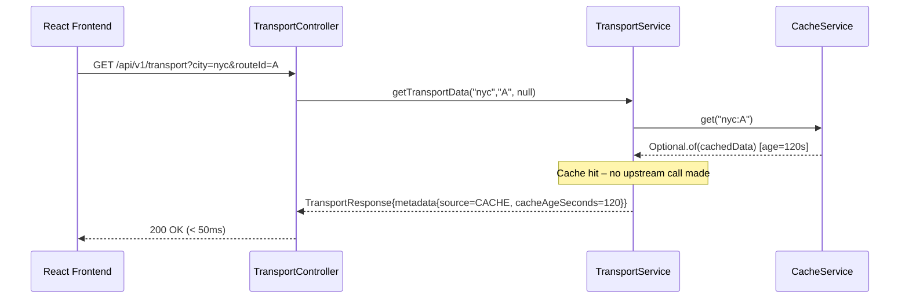
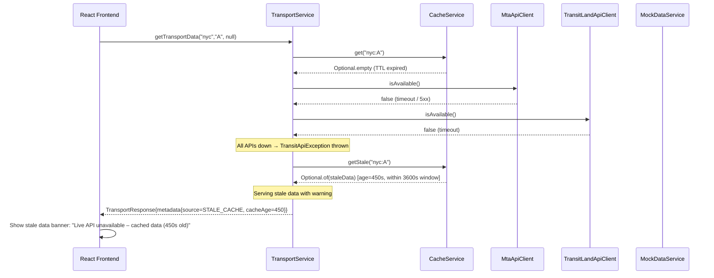
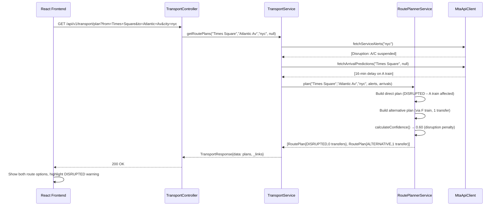
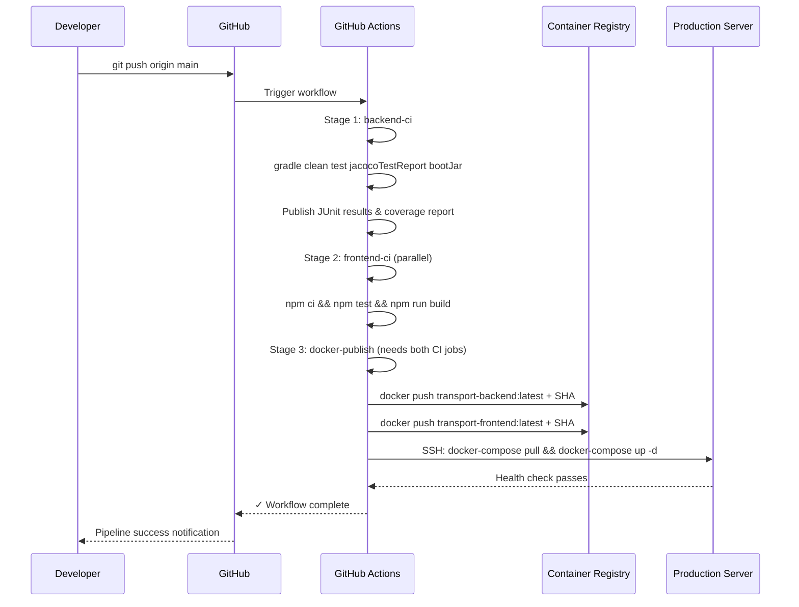

# Sequence Diagrams – Public Transport Tracker

All diagrams are in [Mermaid](https://mermaid.js.org/) format.
Render at https://mermaid.live or import to draw.io.

---

## 1. Normal Flow – Live Data Fetch

```mermaid
sequenceDiagram
    participant UI   as React Frontend
    participant GW   as nginx (Port 80)
    participant API  as TransportController
    participant SVC  as TransportService
    participant CSH  as CacheService
    participant MTA  as MtaApiClient
    participant TL   as TransitLandApiClient
    participant ALT  as AlertService

    UI->>GW:  GET /api/v1/transport?city=nyc&routeId=A
    GW->>API: Proxy request
    API->>SVC: getTransportData("nyc","A", null)

    SVC->>CSH: get("nyc:A")
    CSH-->>SVC: Optional.empty (cache miss)

    SVC->>MTA: isAvailable()
    MTA-->>SVC: true

    SVC->>MTA: fetchVehicleLocations("nyc","A")
    MTA->>MTA: HTTP GET /api/schedule/A/vehicles.json
    MTA-->>SVC: List<VehicleLocation>

    SVC->>MTA: fetchServiceAlerts("nyc")
    MTA-->>SVC: List<ServiceAlert>

    SVC->>MTA: fetchCrowdingInfo("A")
    MTA-->>SVC: List<CrowdingInfo>

    SVC->>ALT: evaluate(transportData)
    ALT-->>SVC: List<AlertMessage> [DELAY warning triggered]

    SVC->>CSH: put("nyc:A", transportData)
    CSH-->>SVC: cached (TTL=300s)

    SVC-->>API: TransportResponse{data, metadata{source=LIVE}, _links}
    API-->>GW:  200 OK + JSON
    GW-->>UI:   200 OK + JSON

    UI->>UI: Render VehicleMap, ArrivalBoard, AlertBanner
```

---

## 2. Cache Hit Flow



---

## 3. API Failure – Stale Cache Fallback



---

## 4. Offline Mode Flow

```mermaid
sequenceDiagram
    participant UI  as React Frontend
    participant SVC as TransportService
    participant MCK as MockDataService
    participant ALT as AlertService

    Note over UI: User toggles Offline Mode ON

    UI->>SVC: getTransportData("nyc","A", offline=true)

    Note over SVC: Offline mode intercepted immediately
    SVC->>MCK: getMockData("nyc","A")
    MCK->>MCK: Load from mock-data/*.json (or generate synthetic)
    MCK-->>SVC: TransportData (mock vehicles, arrivals, alerts)

    SVC->>ALT: evaluate(mockData)
    ALT-->>SVC: List<AlertMessage> [DELAY, DISRUPTION, CROWDING, WEATHER triggered by mock data]

    SVC-->>UI: TransportResponse{metadata{source=MOCK, offlineMode=true}}

    UI->>UI: Show "Offline mode active – showing sample data" banner
    UI->>UI: Render mock vehicles, arrivals, alerts
```

---

## 5. Route Planning Flow



---

## 6. Conditional Alert Evaluation

```mermaid
sequenceDiagram
    participant SVC as TransportService
    participant ALT as AlertService

    SVC->>ALT: evaluate(transportData)

    ALT->>ALT: checkVehicleDelays(vehicles)
    Note over ALT: VEH-A-001: delaySeconds=960 > 900 (15 min threshold)
    ALT->>ALT: → ADD AlertMessage{DELAY, "Significant delays - Plan accordingly"}

    ALT->>ALT: checkServiceDisruptions(alerts)
    Note over ALT: Alert type=DISRUPTION found
    ALT->>ALT: → ADD AlertMessage{DISRUPTION, "Service alert - Check alternative routes"}

    ALT->>ALT: checkCrowding(crowding)
    Note over ALT: CrowdingInfo{level=FULL}
    ALT->>ALT: → ADD AlertMessage{CROWDING, "Vehicle at capacity - Consider next service"}

    ALT->>ALT: checkWeatherAlerts(alerts)
    Note over ALT: Alert cause=WEATHER found
    ALT->>ALT: → ADD AlertMessage{WEATHER, "Weather impact on schedule"}

    ALT-->>SVC: [DELAY, DISRUPTION, CROWDING, WEATHER alerts]
```

---

## 7. CI/CD Pipeline

